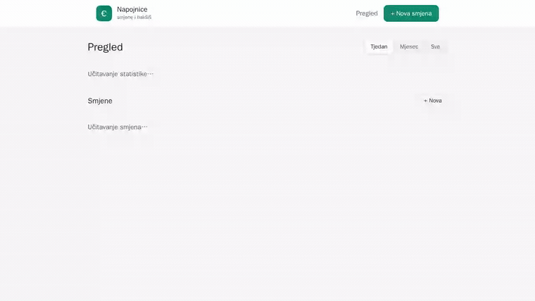
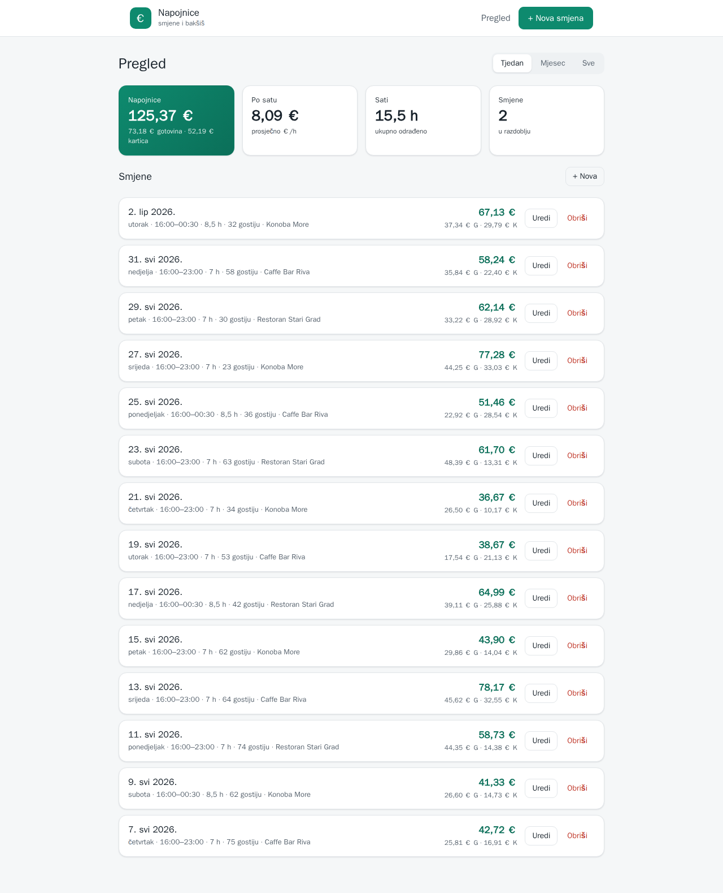
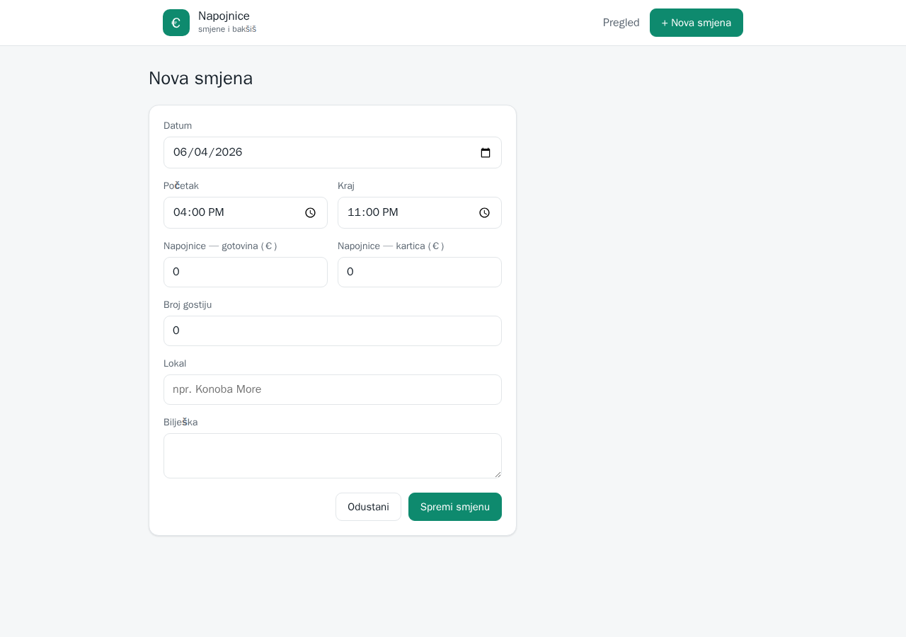

# 💶 Napojnice — pratitelj smjena i napojnica za konobare

> Full-stack aplikacija za konobare: bilježi **smjene** i **napojnice (bakšiš)**, automatski računa odrađene sate i **zaradu po satu**, te prikazuje tjedne/mjesečne agregate.



---

## ✨ Funkcionalnosti
- **Unos smjene** — datum, početak–kraj (auto-izračun sati, podržava **prekonoćne smjene**), napojnice (gotovina/kartica), broj gostiju, lokal, bilješka.
- **Dashboard** — ukupne napojnice, **€/sat**, sati, broj smjena; prebacivanje razdoblja **Tjedan / Mjesec / Sve**; omjer gotovina/kartica.
- **Popis smjena** — uređivanje i brisanje (full CRUD).
- **Validacija** ulaza (`zod`) i čista troslojna arhitektura (rute → service → Prisma).

## 🧱 Tech stack
| Sloj | Tehnologije |
|------|-------------|
| **Backend** (`apps/api`) | Express · TypeScript · **Prisma** · SQLite · zod |
| **Frontend** (`apps/web`) | React · Vite · TypeScript · **TanStack Query** · React Router |
| **QA** | **Playwright** e2e (desktop + mobile) |
| **Repo** | npm workspaces (monorepo) |

## 🏗️ Arhitektura
```
React SPA (:5173)  ──fetch──▶  Express REST API (:4000)  ──Prisma──▶  SQLite (dev.db)
   TanStack Query              rute → zod → service → ORM            jedna datoteka
```
Odvojeni backend + frontend: SPA komunicira s API-jem preko JSON-a; baza je skrivena iza API-ja.

## 🖼️ Screenshotovi
| Dashboard | Nova smjena |
|---|---|
|  |  |

## 🚀 Pokretanje
```bash
npm install                            # instalira oba workspacea
cp apps/api/.env.example apps/api/.env
npm run -w apps/api prisma:migrate     # kreira SQLite bazu (migracija)
npm run -w apps/api db:seed            # (opcionalno) demo podaci
npm run dev                            # API :4000 + web :5173 paralelno
```
Otvori **http://localhost:5173**.

## 🧪 Testiranje (e2e)
```bash
npm run test:e2e          # native Playwright
npm run test:e2e:docker   # u Docker imageu (npr. WSL)
```
Pokriva: učitavanje dashboarda, prebacivanje razdoblja, polja forme, te **CRUD tok** (dodaj → pojavi se → obriši → nestane) na **desktop i mobile** ekranu.

## 🔌 API
| Metoda | Ruta | Opis |
|--------|------|------|
| GET | `/api/health` | health check |
| GET | `/api/shifts?from=&to=` | popis smjena |
| POST | `/api/shifts` | nova smjena |
| GET | `/api/shifts/:id` | jedna smjena |
| PATCH | `/api/shifts/:id` | uredi smjenu |
| DELETE | `/api/shifts/:id` | obriši smjenu |
| GET | `/api/stats?period=week\|month\|all` | agregati za dashboard |

---

<sub>MVP: jedan korisnik (bez prijave). Sljedeći koraci: autentikacija, podjela napojnica u timu, deploy.</sub>
